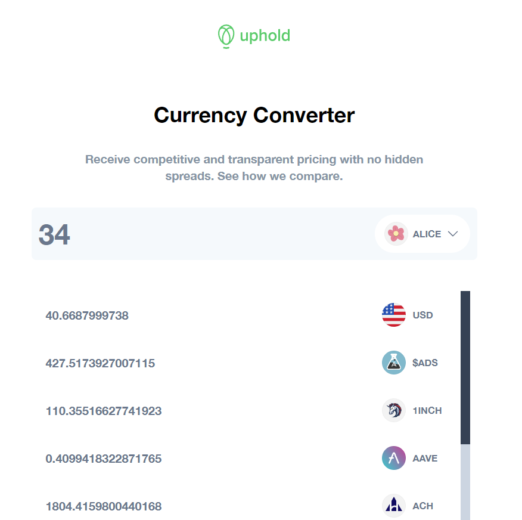

# Frontend Challenge

## Usage

install packages:

```bash
yarn install
```

Run the app:

```bash
yarn start
```

Run unit tests:

```bash
yarn test
```

## Run E2E tests

First run the app

```bash
yarn start
```

Then Cypress with

```bash
yarn e2e
```

## Demo



## Summary

Every criteria and Technical spec was met in this challenge.

- E2E testing was implemented with Cypress.
- Caching and state management with Redux Toolkit.
- Unit tested the components with jest and React Testing Library. (main component App skipped in favor of E2E)
- CORS is handled with http-proxy-middleware
- Pagination on the currency conversion list was implemented with a "fake" infinite loading (due to the sdk method not supporting pagination).
- Supported Currencies are being loaded dinamically with a direct call to the Uphold API (no sdk method).
- Linting tools with Husky/Prettier/Eslint
- Loading state only appears for currencies that are not cached already.
- Responsive design
- Tailwind for CSS
